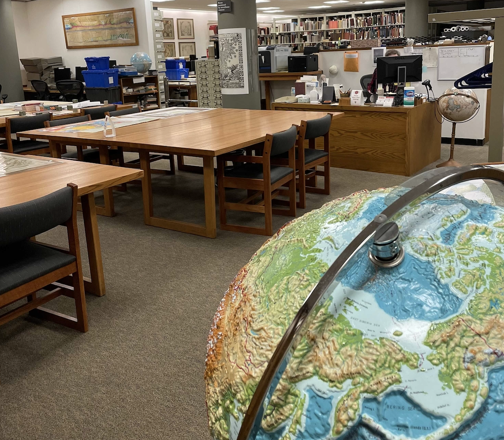
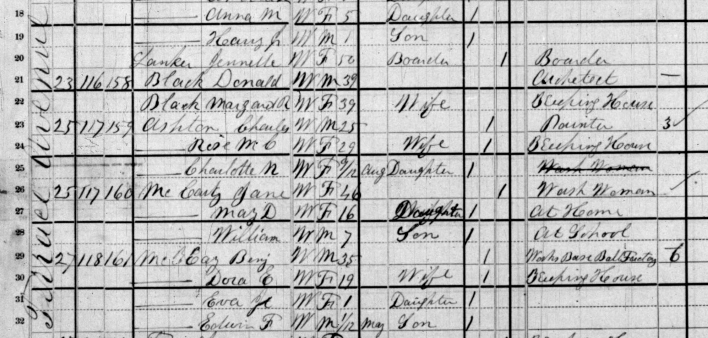
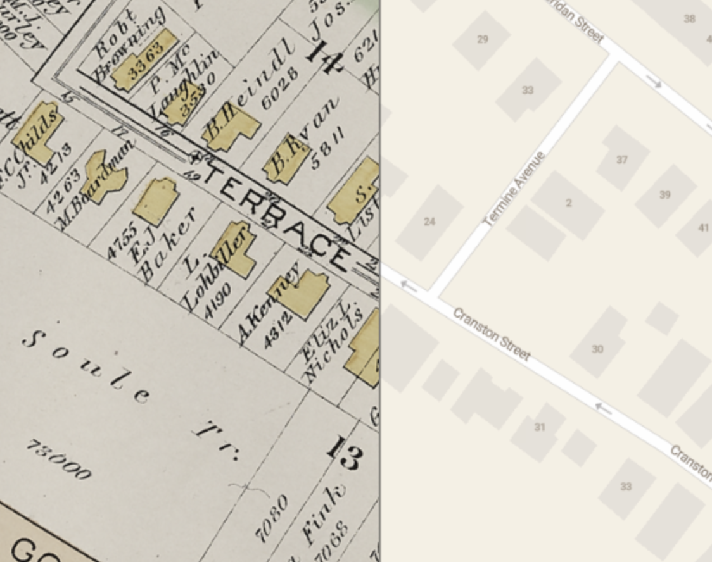
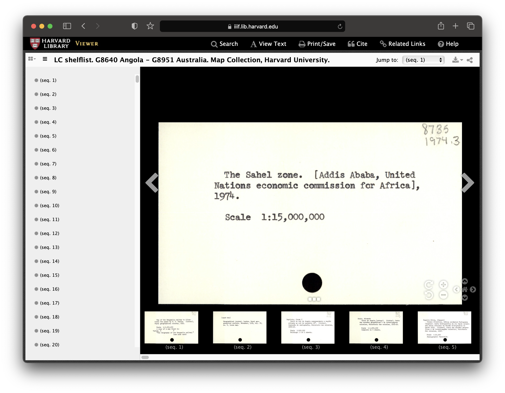

# Harvard Map Collection

## Classes

## Data management

*1880 census from [Archive.org](https://archive.org/details/10thcensus0561unit/page/n45/mode/2up?view=theater)* 

*1890 atlas from [Atlascope](https://atlascope.leventhalmap.org/#view:share$base:000$overlay:39999059011013$zoom:18.70$center:-7915761.314230292,5209123.896271922$mode:swipe-x$pos:0.4491255961844197)*

## Research

    *Record from  [Harvard Map Collection card catalog](https://iiif.lib.harvard.edu/manifests/view/drs:45555303$402i)* 
