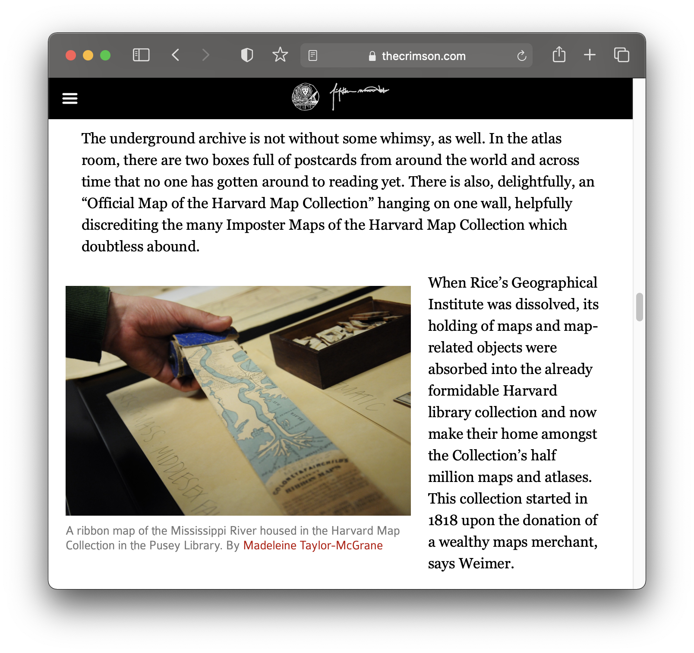
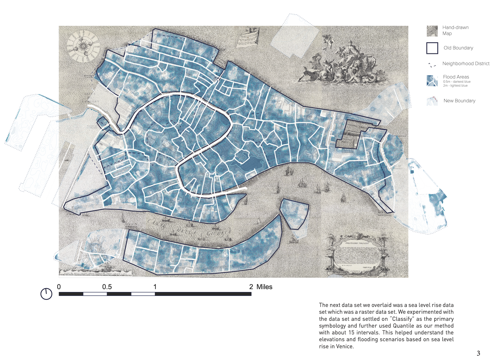

# Harvard Map Collection

*[Crimson article about the](https://www.thecrimson.com/article/2016/4/21/map-collections/) Map Collection.* 

## Classes

*[Fall 2021 presentation](https://docs.google.com/presentation/d/141irEQNA3_SAY2sWqDPoZAheSil0gZZR7yfGWNJhVKg/edit#slide=id.gea70bf8953_0_22).* 

*Map [created by](https://mapping.share.library.harvard.edu/blog/2021/vis-2128/) GSD students working with the Map Collection.* 

## Data management

*1880 census from [Archive.org](https://archive.org/details/10thcensus0561unit/page/n45/mode/2up?view=theater).* 

*[Global volcanoes dataset](https://hgl.harvard.edu/catalog/harvard-glb-volc) in the Harvard Geospatial Library (HGL).* 

## Research

*Record from  [Harvard Map Collection card catalog](https://iiif.lib.harvard.edu/manifests/view/drs:45555303$402i).* 
