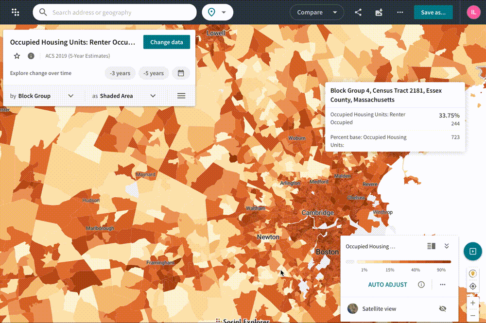

# Mapping Demographic Data

## Maps vs. data

## Do I need geospatial data?

## Planning ahead

Belle Lipton
GIS Outreach Librarian
Harvard Map Collection 
[belle_lipton@harvard.edu](mailto:belle_lipton@harvard.edu)

## Getting started in ten minutes activity

1. Set up a [Social Explorer account with your Harvard Key](http://nrs.harvard.edu/urn-3:hul.eresource:socialex) by choosing `Create Account`and then log in. 
2. Under `Explore Maps` navigate to United States and select `Explore`.
3. Change data to `Housing` > `Tenure` > `Renter Occupied`.
4. Change the geographic unit from `State` to `Census Block Groups`.
5. Zoom in to Cambridge, MA and generate an image by clicking the `Export as image` button in the upper right-hand corner. 
6. In the left-hand menu, click `Tables` > `American Community Surveys (5 year estimates)` and under 2015-2019 select `Begin Report`.
7. Try to figure out how you would download the source data you were just looking at in the interactive visualization. 
8. Now, in order to make a map, you need the shape data. In the left-hand menu, click `Geodata`. Which file would you download?
9. What are your next steps? How would you combine these two datasets together, in order to create a map?
10. Next steps:
    - This [video tutorial series](https://www.youtube.com/playlist?list=PLSNxs7JEaLD0kcr1oXuURFDMEl_7iSR2v) demos how to prepare this data for mapmaking.
    - For one-on-one project consultations, please email [belle_lipton@harvard.edu](mailto:belle_lipton@harvard.edu)